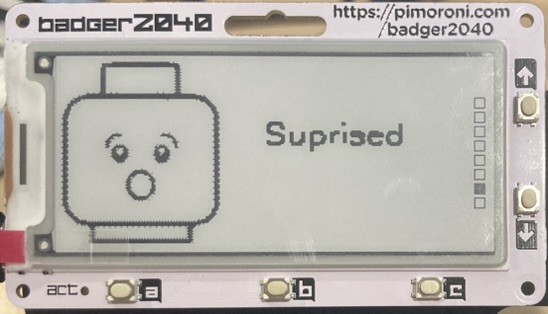

# Badger2040 Mood Display

A visual communication tool designed to help neurodivergent children express their emotional state using the Pimoroni Badger2040 e-ink display. This assistive technology allows children to easily indicate and communicate their current emotional state through a combination of text and images.

## Purpose

This device serves as an emotional communication aid, helping children who may find it challenging to verbally express their feelings. By providing a simple, visual way to display their current emotional state, it can:

- Facilitate communication between children and caregivers
- Help children self-advocate and express their needs
- Reduce anxiety around emotional expression
- Provide a non-verbal method of emotional communication
- Support emotional awareness and regulation



## Features

- Easy-to-use button controls for cycling through different emotional states
- Clear visual display combining text and images
- Persistent state memory (maintains the selected emotion even when powered off)
- High contrast e-ink display that's easy to read and doesn't emit light
- Long battery life with power-efficient design
- Customizable emotions and images to match individual needs
- Optional shortcuts using the A, B and C buttons

## Hardware Requirements

- Pimoroni Badger2040 E-ink Display

The Badger2040 comes with onboard storage, so no additional storage hardware is required.

## Display Specifications

The Badger2040 uses an e-ink display with the following specifications:

- Resolution: 296 x 128 pixels
- Color Depth: 1-bit (black and white only)
- Available RAM: ~128KB for image processing

### Image Requirements

For optimal display quality:

1. Images should be sized appropriately for the 296 x 128 pixel display
   - Recommended size: ~100x100 pixels for images with accompanying text
   - Full width possible if no text is needed (296 pixels)
2. Must be converted to black and white (no grayscale)
3. Saved in JPEG format for compatibility with the jpegdec library
4. High contrast for best visibility on the e-ink display
5. Images are positioned at coordinates (0,0) in the current implementation

### Image Optimization Tips

- Use bold, simple designs that work well in black and white
- Test images on the device to ensure clarity
- Consider using icon-style graphics rather than detailed photographs
- Ensure sufficient contrast between elements
- Avoid fine details that might be lost in the binary conversion

## Setup Instructions

1. Connect your Badger2040 to your computer via USB
2. Copy the `main.py` file to your Badger2040
3. Create a `/moods` directory on the Badger2040's onboard storage
4. Create a `config.json` file in the `/moods` directory with your emotion configurations
5. Add appropriate JPEG images to the `/moods` directory

## Configuration

Create a `config.json` file in the `/moods` directory with your chosen emotions:

```json
{
    "moods": [
        ["Happy", "happy.jpg"],
        ["Sad", "sad.jpg"],
        ["Overwhelmed", "overwhelmed.jpg"],
        ["Need Break", "break.jpg"]
        // Add more emotional states as needed
    ],
    "shortcuts" : {
        // Zero indexed reference to the moods list
        "A" : 4,
        "B" : 2,
        "C" : 0
    }
}
```

Each entry consists of:

- Text to display (keep it simple and clear)
- Filename of the associated image

## Usage Guide

For Children:

- Press UP button to move to the next emotion
- Press DOWN button to go back to the previous emotion
- The screen will stay on for easy viewing
- If configured use the A, B and C buttons as shortcuts

For Caregivers:

- The device maintains its last selected state even when turned off
- The screen automatically refreshes to maintain clarity
- Device enters sleep mode to preserve battery life

## Customization Tips

- Choose clear, recognizable images that represent each emotion
- Use consistent visual styles across images
- Consider using familiar symbols or characters
- Keep text descriptions simple and direct
- Adapt the emotion options based on individual needs

## File Structure

```
/
├── main.py
├── state.txt         # Stores the current emotional state
└── moods/
    ├── config.json   # Emotion configuration file
    ├── happy.jpg     # Emotion images
    ├── sad.jpg
    └── overwhelmed.jpg
```

## Contributing

Contributions to make this tool more effective for neurodivergent children are welcome. Some areas for development:

- Additional emotion sets for different age groups or needs
- Improved user interface designs
- Documentation translations
- Alternative image sets
- Accessibility improvements

## Adapting for Different Needs

This tool can be customized for various situations:

- Different age groups
- Various communication needs
- Different emotional vocabularies
- Multiple languages
- Different symbol sets or communication systems
